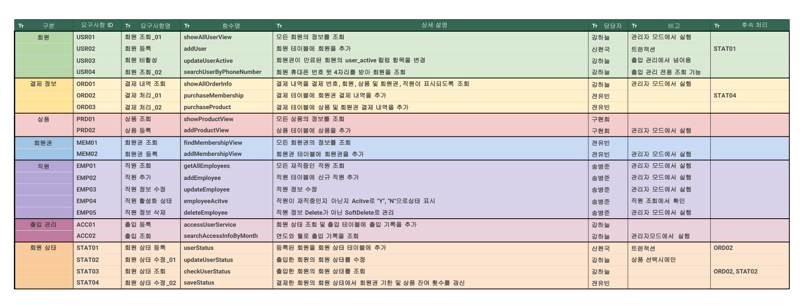
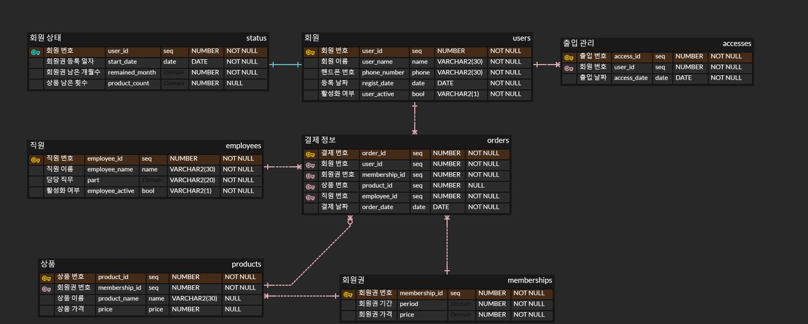
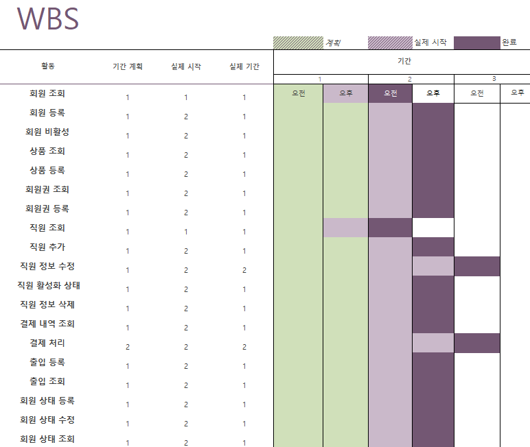
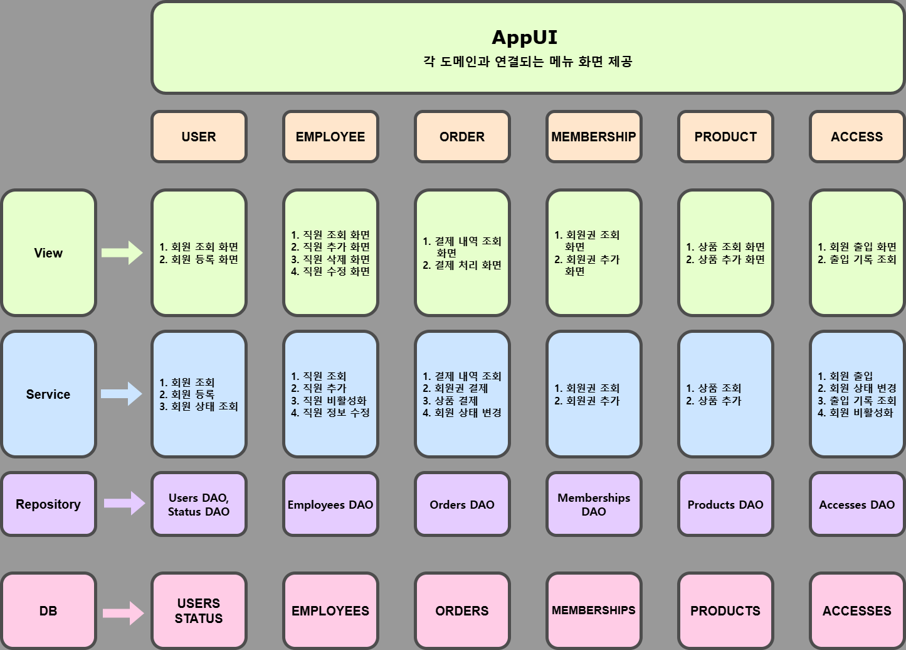
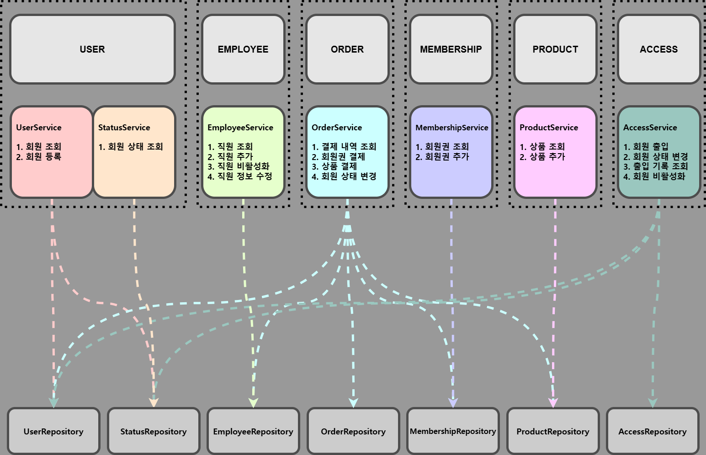

# 💻프로젝트 기획서

## 1. 개요

**_프로젝트명_**: gym_service

**_프로젝트 기간_**: 2025-03-24 ~ 2025-03-27

**_팀장:_** 강하늘 **_팀원:_** 전유빈, 신현국, 송병준, 구현희

## 2. 목적 및 배경

#### 주제 선정 이유

건강에 대한 관심이 높아짐에 따라 많은 사람들이 이용하는 시설인 헬스장의 관리 시스템을 개발하여,
실생활에 유용하게 적용할 수 있는 프로그램을 만들고자 하였습니다.

#### 목표

1. 효율적인 회원 관리 및 이용
2. 회원 데이터 관리 안전성과 보안 강화
3. Java, SQL, 협업 연습을 통한 발전

## 3. 개발 환경

- 프로그래밍 언어: Java
- 데이터베이스: Oracle database
- 개발 도구: Intellij
- 형성 관리 툴: GitHub

## 4. 주 개발 범위

- Java
  - 회원, 직원, 상품, 회원권, 출입관리 등 주요 기능 개발
  - 트랜잭션 처리 및 예외 관리
- DB
  - 회원 상태, 회원 및 직원 정보, 출입 기록, 결제 정보, 상품 및 회원권 저장
- 서비스 소개
  - 회원 및 직원 관리, 상품 및 회원권 운영, 출입 기록 관리를 처리할 수 있도록 설계한 서비스입니다. Oracle Database를 활용하여 데이터를 저장 및 관리하며, Java를 기반으로 개발하였습니다.

## 5. 주요 기능

#### 회원 & 직원

- **회원**: 회원 조회, 등록, 활성/비활성
- **직원**: 직원 조회, 추가, 수정, 활성/비활성, 삭제

#### 상품 & 회원권

- **상품**: 상품 조회, 등록
- **회원권**: 회원권 조회, 등록

#### 출입 관리 & 회원 상태

- **출입 관리**: 출입 조회, 등록
- **회원 상태**: 상태 조회, 등록, 수정

## 6. 요구사항 정의 및 ERD

[요구사항 정의서](https://docs.google.com/spreadsheets/d/1u56s9X5dFNKIewTSbZ1xqQzytP-0plldXfokaezeUCc/edit?gid=391646514#gid=391646514)

## 7. WBS (Work Breakdown Structure)

## 8. 트러블 슈팅 및 한계점

| 🛠   | 과제                  | 한계점                                      | 해결 방안                                                |
| --- | --------------------- | ------------------------------------------- | -------------------------------------------------------- |
| 1   | 회원 할인 제도 도입   | 회원 등급에 따른 할인 혜택 제공 불가        | 등급 결정 기준과 할인율 기준을 설정하고 회원 등급을 관리 |
| 2   | 환불 기능 추가        | 상품 및 회원권 환불 불가                    | 환불 정책 설립 후 로직 구현                              |
| 3   | 양도 기능 추가        | 상품 및 회원권 양도 불가                    | 양도 정책 설립 후 구현                                   |
| 4   | PT 예약 시스템        | 회원과 트레이너 간의 예약 불가              | 예약 시스템 구현                                         |
| 5   | 트랜잭션 처리         | 데이터 무결성과 일관성 보장이 어려움        | 트랜잭션 적용                                            |
| 6   | 중복 코드 처리        | 유지보수성, 가독성 저하                     | 중복되는 코드들을 메서드 처리                            |

## 9. 스토리 보드 및 화면 명세서
[스토리보드](deliverables/StoryBoard.pdf)

[화면 명세서](deliverables/WireFrame.pdf)

## 10. MSA 설계서
  

## 10. 회고

**강하늘**  
협업을 경험하게 되면서, 함께 개발하는 방법을 많이 배운 것 같습니다. 너무나도 부족한 팀장이었지만 감사하게도 좋은 팀원분들과 함께 할 수 있어서 잘 마무리할 수 있었다고 생각합니다. 개발을 진행하며 MSA에 대해 더 탐구해보게 되었고, git과 같은 협업 툴이 가지는 힘에 대해서도 체감할 수 있는 좋은 경험이었던 것 같습니다. 시간상의 제약으로 미처 구현하지 못한 기능들 또한 후에 같이 개발해보고 더 확장시킬 수 있는 기회가 있다면 참여하고 싶습니다.

**전유빈**  
단위 프로젝트를 하면서 예상치 못한 상황이나 에러들을 대처하며
팀원들과 소통하며 해결해 나가는 점에서 혼자 하는 것 보다 팀원들과 소통하면서 함께 진행하는점이 여러가지로 문제해결하는 부분에서 많은 도움이 되는것을 느꼈고
잘 모르는것 또는 잘 아는것들 을 다시공부하고 팀원분들에게 설명도 하고
기획 단위부터 팀원들과 맞춰서 하다보니 생각하지 못했던 부분이나 모자랐던 부분들도 더 알게되어 어느부분들을 더 보완하면서 공부해야할지 알게되는 시간이었습니다

**신현국**  
이번 프로젝트를 통해 코딩만큼이나 중요한 요소가 시스템 및 기능 파악, 그리고 팀원들과의 원활한 의사소통이라는 것을 깨닫게 되었습니다. 특히 Git을 잘 활용하지 못했었는데, 팀원들의 도움 덕분에 Git을 사용하는 방법을 익히고 점차 적응할 수 있었습니다.
비록 코드를 작성하는 부분에서는 큰 기여를 하지 못했지만, 프로젝트를 진행하는 전반적인 흐름과 중요한 단계들을 이해하며 프로젝트 진행 방식과 협업의 중요성을 배울 수 있었습니다. 이는 앞으로의 프로젝트 참여에 큰 밑거름이 될 소중한 경험이었습니다.

**송병준**
  1. 목표 및 기대 성과 :
      팀원에게 피해주지 않고 최대한 해결해보려하기가 목표였는데 우려했던것만큼 아예 못만드는 정도는 아니였어서 다행이였습니다.

  2. 주요 성과 및 기여 :
    employee파트 부분 조회, 추가, 수정, 삭제, 활성화 기능을 구현하였습니다.

  3. 배운 점 및 개선점 :
   다양한 방식의 코드도 입력해보고 테스트하고 수정하는 과정을 해보니 조금씩 코드를 아예 볼 줄 몰랐는데 눈이 띄여지는 느낌입니다.
   코드 입력 작업을 더 자주 해보고 기본 용어나 기초적인것들을 더 공부하여 다음 프로젝트때는 이번 프로젝트보다는 덜 질문하고 혼자 해결하는 능력을 키워야겠습니다.

  4. 전체적인 소감 :
  너무 좋은 조장님과 팀원들을 만나서 개발에대하여 막막하기만했었는데 조금씩 풀려가는 느낌이라 개인적으로 매우 감사한 경험이였습니다.
  모르는게 많아서 피해를 많이 끼쳤을텐데 쓴소리 없이 친절히 도와준 다른분들께 너무 고마웠고 공부를 더 많이 해야겠다는 생각이 학원 들어왔을 초반보다는 구체적으로 설계가 되는것같아서 좋았습니다.

**구현희**  
이번 프로젝트를 통해 git을 잘 다루는 것이 협업에서 필수적이라는 것을 깨달았고, 연습을 통해 숙련도를 향상시켜야겠다고 느꼈다. 또한 요구사항에 대한 해결 능력을 기르기 위해 노력해야겠다는 생각이 들었다. 다음 프로젝트에서는 이러한 경험을 바탕으로 부족했던 부분을 개선하고, 더 의미 있는 기여를 할 수 있도록 노력할 것이다.
